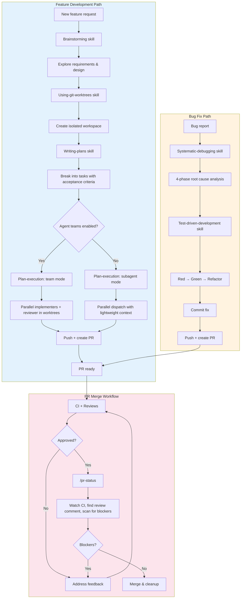

# Development Workflow Plugin for Claude Code

A comprehensive Claude Code plugin for feature development, bug fixes, and PR workflows. Enforces best practices through upfront planning, parallelized subagent execution, verification agents, and workflow commands.

## Features

- **Upfront planning** - Brainstorming and structured implementation plans before code
- **Plan execution** - Parallel implementation via agent teams (worktrees + mailbox) or subagents (`run_in_background`), auto-selected
- **Git worktree support** - Isolated workspaces for parallel development
- **Pre-commit verification** - Type checking, security scans, debug code detection
- **PR readiness checks** - CI verification, review comment polling, blocker scanning
- **Git guardrails** - Blocks direct pushes to main, warns on raw merge commands
- **Code review agents** - Staff-level comprehensive reviews
- **Context recovery** - Restore state after context compaction

## Philosophy

This plugin enforces three core principles:

### 1. Planning Before Implementation
Features start with **brainstorming** (Socratic exploration of requirements and design), followed by **writing plans** that break work into bite-sized, verifiable tasks. This catches issues early and provides clear success criteria.

### 2. Parallel Execution with Mode Selection
**Plan execution** automatically selects the best execution mode:
- **Team mode** (when agent teams enabled): Multiple implementers in worktrees, dedicated reviewer with mailbox communication, lead in delegate mode
- **Subagent mode** (default): Parallel dispatch via `run_in_background`, each subagent gets only what you pass it (lightweight context), independent model selection per task

Subagent mode is more efficient for well-scoped tasks — subagents start fresh with just their prompt, avoiding full context loading overhead.

### 3. Parallelization Through Isolation
**Git worktrees** + agents enable true parallel development:
- Multiple features/experiments in isolated workspaces
- Agents work independently without blocking
- Easy cleanup (delete worktree, no branch pollution)

## Complete Development Workflow



### Feature Development Path

| Phase | Skill/Command | Purpose |
|-------|---------------|---------|
| **1. Design** | `brainstorming` | Socratic exploration of requirements and design trade-offs |
| **2. Isolate** | `using-git-worktrees` | Create isolated workspace (optional, for parallel work) |
| **3. Plan** | `writing-plans` | Break feature into bite-sized tasks with acceptance criteria |
| **4. Execute** | `plan-execution` | Parallel via agent teams or subagents (auto-selected) |
| **5. PR & Merge** | `/pr-status` | Watch CI, find review comment, fix loop until ready, merge |

### Bug Fix Path

| Phase | Skill/Command | Purpose |
|-------|---------------|---------|
| **1. Analyze** | `systematic-debugging` | 4-phase root cause analysis (gather, hypothesize, verify, fix) |
| **2. Test** | `test-driven-development` | Red-green-refactor discipline |
| **3. Commit** | N/A | Commit fix with conventional message |
| **4. PR & Merge** | `/pr-status` | Create PR, watch CI, review comment check, merge |

### Git Guards

The plugin prevents common mistakes:

| Action | On Main | On Feature Branch |
|--------|---------|-------------------|
| `git commit` | Blocked | Allowed |
| `git push origin main` | Blocked | N/A |
| `gh pr merge` | Warned (run /pr-status first) | Warned (run /pr-status first) |

### Execution Preference

When executing implementation plans (from `writing-plans` or similar), use `dev-workflow:plan-execution`. It automatically selects the best mode:

- **Team mode** (agent teams enabled): parallel teammates in worktrees with mailbox communication
- **Subagent mode** (default): parallel dispatch via `run_in_background` with lightweight context per task

## Installation

### Option 1: Direct from GitHub (Recommended)

```bash
/plugin marketplace add tombakerjr/claude-code-pr-workflow
/plugin install dev-workflow@claude-code-pr-workflow
```

Then restart Claude Code.

### Option 2: From Local Clone

```bash
git clone https://github.com/tombakerjr/claude-code-pr-workflow.git
/plugin marketplace add /path/to/claude-code-pr-workflow
/plugin install dev-workflow@tombakerjr-claude-tools
```

Then restart Claude Code.

## Components

### Slash Commands

| Command | Description |
|---------|-------------|
| `/pr-status` | **Watch CI, find review comment, scan for blockers, report readiness** |
| `/context-recovery` | Recover git/PR state after context compaction |

### Agents

| Agent | Description |
|-------|-------------|
| `staff-code-reviewer` | Comprehensive review: security, correctness, performance, architecture |
| `quick-reviewer` | Fast combined spec+quality review for simple tasks (≤2 files) |
| `code-verifier` | Pre-commit: typecheck, security scan, debug code detection |
| `pr-verifier` | Pre-merge: CI status, comment wait, blocker detection |
| `implementer` | Task implementation agent (Sonnet default, Haiku for mechanical work) |
| `spec-reviewer` | Verify implementation matches spec and acceptance criteria |
| `quality-reviewer` | Fast quality gate: code quality, test coverage, documentation |

### Skills

| Skill | Description |
|-------|-------------|
| `plan-execution` | Execute implementation plans — agent teams (worktrees + mailbox) or subagents (`run_in_background`), auto-selected |
| `test-driven-development` | Red-green-refactor discipline for features and bug fixes |
| `systematic-debugging` | 4-phase root cause analysis: gather, hypothesize, verify, fix |
| `writing-plans` | Create bite-sized task plans with acceptance criteria |
| `using-git-worktrees` | Create isolated workspaces for parallel development |
| `brainstorming` | Socratic exploration of requirements and design trade-offs |

### Hooks

| Hook | Event | Function |
|------|-------|----------|
| `git-guard.py` | PreToolUse:Bash | Blocks commits on main/master, blocks push to main/master, warns on raw `gh pr merge` |
| `task-completed-gate.py` | TaskCompleted | Prevents implementation tasks from being marked complete before review |
| `stop-check.sh` | Stop | Warns about uncommitted changes, open PRs, changes on main |
| `workflow-preferences.sh` | SessionStart | Injects execution preferences (use plan-execution) |

## The PR Readiness Check

The `/pr-status` command enforces this critical workflow:

1. **CI passes** — Watch all checks to completion with `gh pr checks --watch`
2. **Find the review comment** — Poll until the review bot's comment from the current CI run is found
3. **Read and assess** — Check for CRITICAL, FIX, BLOCKER, DO NOT MERGE
4. **Report verdict** — READY TO MERGE or CHANGES NEEDED with specifics

**Why poll for the review comment?** The review workflow ALWAYS posts a comment (either approving or requesting changes). The absence of this comment is NOT tacit approval — `/pr-status` polls with timestamp validation to ensure no review feedback is missed.

## Usage Examples

### Checking PR Readiness
```
> Is my PR ready to merge?
# Claude runs /pr-status — watches CI, finds review comment, reports verdict
```

### Merging a PR
```
> Merge my PR
# Claude runs /pr-status first, then merges if READY TO MERGE
```

### Code Review
```
> Review my recent changes
# Claude invokes staff-code-reviewer agent
```

### Pre-commit Verification
```
> Verify my code before I commit
# Claude invokes code-verifier agent
```

## Customization

### Review Criteria

Add organization-specific review criteria to `agents/staff-code-reviewer.md`:

```markdown
### 6. Organization Standards
- [Your coding standards]
- [Your security requirements]
```

### Additional Git Guards

Add patterns to `hooks/git-guard.py`:

```python
blocked = [
    (r'git\s+push\s+.*\b(main|master)(\s|$)',
     "BLOCKED: Direct push to main/master."),
    # Add your own:
    (r'git\s+push\s+--force',
     "BLOCKED: Force push requires explicit approval."),
]
```

## Requirements

- Claude Code CLI
- `gh` CLI (GitHub CLI) for PR operations
- Git
- For Windows: Git for Windows (provides bash for hooks)

## License

MIT
