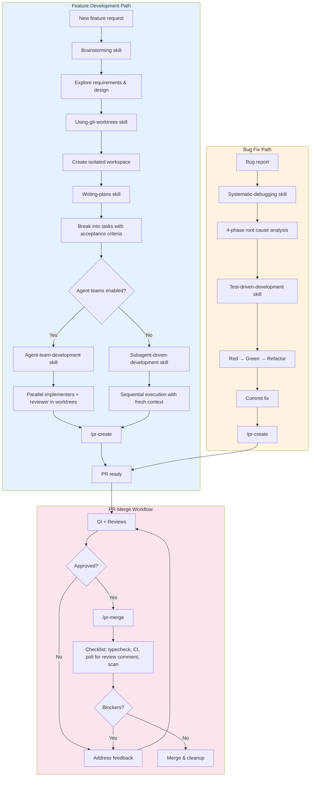

# Development Workflow Plugin for Claude Code

A comprehensive Claude Code plugin for feature development, bug fixes, and PR workflows. Enforces best practices through upfront planning, parallelized subagent execution, verification agents, and workflow commands.

## Features

- **Upfront planning** - Brainstorming and structured implementation plans before code
- **Agent team execution** - True parallel implementation with multiple agents, dedicated reviewer, and mailbox communication
- **Subagent execution** - Sequential execution with fresh context per task (fallback)
- **Git worktree support** - Isolated workspaces for parallel development
- **Pre-commit verification** - Type checking, security scans, debug code detection
- **PR merge checklist** - CI verification, delayed comment detection, blocker scanning
- **Git guardrails** - Blocks direct pushes to main, warns on raw merge commands
- **Code review agents** - Staff-level comprehensive reviews
- **Context recovery** - Restore state after context compaction

## Philosophy

This plugin enforces three core principles:

### 1. Planning Before Implementation
Features start with **brainstorming** (Socratic exploration of requirements and design), followed by **writing plans** that break work into bite-sized, verifiable tasks. This catches issues early and provides clear success criteria.

### 2. Agent Teams for True Parallelism
When agent teams are enabled, **agent-team-development** provides:
- Multiple implementers working simultaneously in separate git worktrees
- Dedicated reviewer communicating feedback directly via mailbox
- Lead coordinator in delegate mode for orchestration-only
- Automatic fallback to subagent-driven-development when teams aren't available

### 3. Subagents for Context Hygiene
**Subagent-driven development** (fallback) provides:
- Main conversation stays clean (planning and orchestration)
- Each task gets fresh context (implementer subagent reads files it needs)
- Prevents context bloat from 50k+ token file dumps
- Enables independent work verification

### 4. Parallelization Through Isolation
**Git worktrees** + agents enable true parallel development:
- Multiple features/experiments in isolated workspaces
- Agents work independently without blocking
- Easy cleanup (delete worktree, no branch pollution)

## Complete Development Workflow



### Feature Development Path

| Phase | Skill/Command | Purpose |
|-------|---------------|---------|
| **1. Design** | `brainstorming` | Socratic exploration of requirements and design trade-offs |
| **2. Isolate** | `using-git-worktrees` | Create isolated workspace (optional, for parallel work) |
| **3. Plan** | `writing-plans` | Break feature into bite-sized tasks with acceptance criteria |
| **4. Execute** | `agent-team-development` | Parallel agent teams (falls back to `subagent-driven-development`) |
| **5. PR** | `/pr-create` | Typecheck, push, create PR |
| **6. Merge** | `/pr-merge` | Full checklist with delayed comment detection |

### Bug Fix Path

| Phase | Skill/Command | Purpose |
|-------|---------------|---------|
| **1. Analyze** | `systematic-debugging` | 4-phase root cause analysis (gather, hypothesize, verify, fix) |
| **2. Test** | `test-driven-development` | Red-green-refactor discipline |
| **3. Commit** | N/A | Commit fix with conventional message |
| **4. PR** | `/pr-create` | Create PR for review |
| **5. Merge** | `/pr-merge` | Full merge checklist |

### Git Guards

The plugin prevents common mistakes:

| Action | On Main | On Feature Branch |
|--------|---------|-------------------|
| `git commit` | Blocked | Allowed |
| `git push origin main` | Blocked | N/A |
| `gh pr merge` | Warned (use /pr-merge) | Warned (use /pr-merge) |

### Execution Preference

When executing implementation plans (from `writing-plans` or similar), this plugin enforces:

- **Preferred**: `dev-workflow:agent-team-development` - parallel agent teams with worktree isolation
- **Fallback**: `dev-workflow:subagent-driven-development` - sequential subagents (when agent teams not enabled)
- **Not**: Alternative execution methods that cause context bloat

Agent-team-development automatically detects whether agent teams are enabled and falls back to subagent-driven-development when they aren't.

## Installation

### Option 1: Direct from GitHub (Recommended)

```bash
/plugin marketplace add tombakerjr/claude-code-pr-workflow
/plugin install dev-workflow@claude-code-pr-workflow
```

Then restart Claude Code.

### Option 2: From Local Clone

```bash
git clone https://github.com/tombakerjr/claude-code-pr-workflow.git
/plugin marketplace add /path/to/claude-code-pr-workflow
/plugin install dev-workflow@tombakerjr-claude-tools
```

Then restart Claude Code.

## Components

### Slash Commands

| Command | Description |
|---------|-------------|
| `/pr-create` | Verify branch, typecheck, push, create PR with template |
| `/pr-status` | Quick CI + comments + blockers overview |
| `/pr-merge` | **Full merge checklist** - never skip this |
| `/context-recovery` | Recover git/PR state after context compaction |

### Agents

| Agent | Description |
|-------|-------------|
| `staff-code-reviewer` | Comprehensive review: security, correctness, performance, architecture |
| `quick-reviewer` | Fast combined spec+quality review for simple tasks (≤2 files) |
| `code-verifier` | Pre-commit: typecheck, security scan, debug code detection |
| `pr-verifier` | Pre-merge: CI status, comment wait, blocker detection |
| `implementer` | Task implementation agent (Sonnet default, Haiku for mechanical work) |
| `spec-reviewer` | Verify implementation matches spec and acceptance criteria |
| `quality-reviewer` | Fast quality gate: code quality, test coverage, documentation |

### Skills

| Skill | Description |
|-------|-------------|
| `agent-team-development` | Execute plans with parallel agent teams, dedicated reviewer, and worktree isolation (preferred) |
| `subagent-driven-development` | Execute implementation plans with sequential subagents and fresh context (fallback) |
| `test-driven-development` | Red-green-refactor discipline for features and bug fixes |
| `systematic-debugging` | 4-phase root cause analysis: gather, hypothesize, verify, fix |
| `writing-plans` | Create bite-sized task plans with acceptance criteria |
| `using-git-worktrees` | Create isolated workspaces for parallel development |
| `brainstorming` | Socratic exploration of requirements and design trade-offs |

### Hooks

| Hook | Event | Function |
|------|-------|----------|
| `git-guard.py` | PreToolUse:Bash | Blocks commits on main/master, blocks push to main/master, warns on raw `gh pr merge` |
| `task-completed-gate.py` | TaskCompleted | Prevents implementation tasks from being marked complete before review |
| `stop-check.sh` | Stop | Warns about uncommitted changes, open PRs, changes on main |
| `workflow-preferences.sh` | SessionStart | Injects execution preferences (use agent-team-development) |

## The Merge Checklist

The `/pr-merge` command enforces this critical workflow:

1. **Typecheck** - Catch type errors before merge
2. **CI passes** - Use `gh pr checks --watch` to wait for completion
3. **Poll for review comment** - Claude review ALWAYS posts a comment
4. **Scan for blockers** - CRITICAL, FIX, BLOCKER, DO NOT MERGE
5. **Only merge when clear** - Human verification required

**Why poll for the review comment?** Claude code review ALWAYS posts a comment (either approving or requesting fixes). The absence of this comment is NOT tacit approval - we poll until found to ensure no review feedback is missed.

## Usage Examples

### Creating a PR
```
> Create a PR for my changes
# Claude runs /pr-create, which typechecks and creates PR
```

### Checking PR Status
```
> What's the status of my PR?
# Claude runs /pr-status
```

### Merging a PR
```
> Merge my PR
# Claude runs /pr-merge with full checklist
```

### Code Review
```
> Review my recent changes
# Claude invokes staff-code-reviewer agent
```

### Pre-commit Verification
```
> Verify my code before I commit
# Claude invokes code-verifier agent
```

## Customization

### Typecheck Commands

Commands default to trying `pnpm run typecheck || npm run typecheck || yarn typecheck`. Edit the commands to match your project:

- `commands/pr-create.md`
- `commands/pr-merge.md`

### Review Criteria

Add organization-specific review criteria to `agents/staff-code-reviewer.md`:

```markdown
### 6. Organization Standards
- [Your coding standards]
- [Your security requirements]
```

### Additional Git Guards

Add patterns to `hooks/git-guard.py`:

```python
blocked = [
    (r'git\s+push\s+.*\b(main|master)(\s|$)',
     "BLOCKED: Direct push to main/master."),
    # Add your own:
    (r'git\s+push\s+--force',
     "BLOCKED: Force push requires explicit approval."),
]
```

## Requirements

- Claude Code CLI
- `gh` CLI (GitHub CLI) for PR operations
- Git
- For Windows: Git for Windows (provides bash for hooks)

## License

MIT
